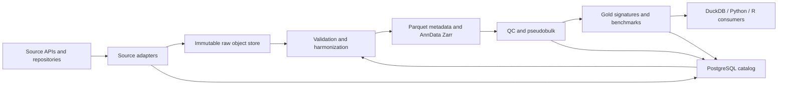

# Database and ingestion plan

Status: proposed architecture for the RNA-only cancer/cell-line MVP
Last reviewed: 2026-06-20

## 1. Decisions

1. Start with human cancer cell lines, RNA, genetic perturbations, and small molecules.
2. Use PostgreSQL as the metadata/provenance control plane, not as a cell-expression store.
3. Keep immutable source files and large matrices in S3-compatible object storage. A local filesystem can implement the same layout during development.
4. Store queryable tabular data as Parquet and curated sparse matrices as AnnData Zarr. Keep H5AD as an import/export format. Read CELLxGENE Census in its native TileDB-SOMA representation rather than copying the whole Census.
5. Treat a dataset release as immutable. A changed upstream file creates a new release and never silently replaces an old artifact.
6. Model a perturbation as an intervention with one or more components. This supports single drugs, genetic perturbations, and combinations without overloading one text column.
7. Use scPerturb to bootstrap the MVP, but audit every selected dataset against its primary repository and paper before admitting it to analysis.
8. Defer the full Tahoe-100M expression download. Ingest its metadata and released pseudobulk differential-expression products first.

## 2. System architecture



### Control plane: PostgreSQL

PostgreSQL holds small, relational, frequently filtered information:

- studies, datasets, immutable releases, and external accessions;
- source URLs, licenses, checksums, retrieval history, and artifact lineage;
- assays, biosamples, cell-line contexts, batches, and replicate structure;
- canonical perturbations, components, targets, doses, times, and controls;
- ontology mappings and curation decisions;
- dataset-level and condition-level QC results;
- locations and schemas of matrices, Parquet tables, and analysis outputs.

PostgreSQL must not hold one row per expression value. It also should not hold one row per cell for large releases. Cell-level `obs` data belongs in partitioned Parquet/Zarr; PostgreSQL stores summaries and artifact pointers.

### Data plane: object storage

Use the following logical zones:

```text
data/
  landing/       # incomplete downloads; disposable
  raw/           # byte-identical immutable upstream artifacts
  bronze/        # source-native extracted content
  silver/        # harmonized obs/var and sparse matrices
  gold/          # pseudobulk, DE, signatures, pathway and benchmark tables
  quarantine/    # failed validation; retained with reason
  manifests/     # machine-readable release and run manifests
```

Object keys are deterministic and versioned:

```text
{zone}/{source}/{study_accession}/{dataset_key}/{release_id}/{artifact_name}
```

Raw artifacts are content-addressed in the catalog with SHA-256. Preserve an upstream MD5 when supplied, but compute SHA-256 locally as the project checksum.

### Query layer

- DuckDB queries Parquet directly for exploration and pipeline checks.
- Scanpy/AnnData reads the per-dataset Zarr stores without loading all data.
- R reads gold Parquet tables for meta-analysis.
- A distributed query engine is unnecessary for the MVP and can be added only when concurrent or cross-terabyte queries justify it.

## 3. Core relational model

Use UUID primary keys internally and retain every upstream identifier in `external_identifier`. Important natural keys receive unique constraints.

| Entity | Purpose | Important fields |
|---|---|---|
| `source` | Repository/API definition | name, base_url, adapter, terms_url |
| `study` | Publication-level experiment | title, DOI, PMID, species |
| `dataset` | A biologically coherent dataset | study_id, name, modality, inclusion_status |
| `dataset_release` | Immutable upstream snapshot | dataset_id, source_version, released_at, schema_version |
| `external_identifier` | GEO/SRA/Zenodo/CELLxGENE/etc. IDs | entity_type, entity_id, namespace, accession |
| `artifact` | A file or object-store prefix | release_id, role, URI, bytes, SHA-256, media_type |
| `acquisition_run` | Fetch attempt and result | adapter_version, started_at, status, request_manifest |
| `assay` | Measurement technology | modality, platform, protocol, genome_build |
| `biosample` | Biological context | species, donor, tissue, disease, cell_line, cell_type |
| `experimental_unit` | Replicate/pool/plate unit | biosample_id, batch, plate, replicate_type |
| `agent` | Drug, gene target, guide, or vehicle | agent_type, canonical_name, namespace, canonical_id |
| `intervention` | Complete perturbation definition | intervention_type, duration, schedule, is_control |
| `intervention_component` | Components of an intervention | intervention_id, agent_id, action, dose, unit, order |
| `condition` | Context plus intervention | release_id, assay_id, experimental_unit_id, intervention_id |
| `control_match` | Explicit perturbed-to-control comparison | treated_condition_id, control_condition_id, rule, score |
| `ontology_mapping` | Raw-to-canonical mapping with evidence | entity, raw_value, ontology, term_id, method, confidence |
| `qc_result` | Gate or metric at a declared level | entity, metric, value, threshold, pass |
| `feature_set` | Gene/peak/protein coordinate system | namespace, release, genome_build, artifact_id |
| `analysis_run` | Reproducible transformation | code_commit, container_digest, params, input_manifest |
| `derived_artifact` | Output plus lineage | analysis_run_id, artifact_id, output_role |

### Data that remains outside PostgreSQL

`obs.parquet`, partitioned by `dataset_release_id` and optionally `cell_line`; `var.parquet`, keyed by feature-set version; sparse counts in Zarr; pseudobulk and DE tables in Parquet.

A global cell identifier is deterministic:

```text
cell_id = UUIDv5(dataset_release_id, source_cell_barcode)
```

Retain `source_cell_barcode` separately. Never assume barcodes are globally unique.

## 4. Perturbation contract

The minimum normalized intervention fields are:

```text
intervention_id
intervention_type       # genetic, drug, combination, vehicle, untreated
agent_id
agent_role              # target, guide, compound, vehicle
action                  # knockout, CRISPRi, CRISPRa, exposure, overexpression
target_gene_id          # Ensembl stable ID where applicable
guide_id / guide_sequence
dose_value_raw / dose_unit_raw
dose_molar              # normalized value; null if not meaningful
duration_value_raw / duration_unit_raw
duration_seconds
schedule
MOI
control_class           # untreated, vehicle, non-targeting, positive control
```

Combination identity is based on its component set plus dose, duration, and schedule. Component order is ignored only for simultaneous treatments; sequential schedules remain distinct.

Control matching is data, not an implicit query. A valid comparison should match, where available, study, cell line/type, donor or pool, assay, plate/batch, time, vehicle, and sequencing protocol.

## 5. Source strategy

Prefer APIs and stable repository manifests over HTML scraping. Literature search discovers candidates; repositories provide data.

| Priority | Source | Role | Access method | MVP action |
|---:|---|---|---|---|
| 1 | scPerturb RNA v1.4 | Harmonized perturbation bootstrap | Zenodo REST API and versioned H5AD files | Fetch five selected files and audit counts/metadata |
| 1 | NCBI GEO/SRA | Primary metadata and raw archives | NCBI E-utilities, GEO HTTPS/FTP, SRA Toolkit | Resolve primary accessions and raw-count availability |
| 1 | Tahoe-100M | Large drug atlas | Hugging Face Hub API/Parquet | Metadata and pseudobulk first; full cells later |
| 2 | CELLxGENE Census | Reference cell states/atlas | `cellxgene-census` and TileDB-SOMA | Query selected human cancer/reference contexts |
| 2 | BioStudies/ArrayExpress | European primary archive | BioStudies REST/FTP | Adapter when a selected study is hosted there |
| 2 | LINCS/CMap | Orthogonal drug-signature evidence | Official downloads/API subject to terms | Keep as bulk/L1000 evidence, not single-cell data |
| 2 | DepMap/CCLE | Cell-line covariates | Official portal/API subject to terms | Add lineage/genotype/context after MVP |
| 3 | PubChem and ChEMBL | Compound normalization | PUG REST and ChEMBL API | Resolve CID, ChEMBL ID, SMILES, InChIKey |
| 3 | Ensembl and HGNC | Gene normalization | Versioned downloads/REST | Pin release; map symbols to stable IDs |
| 3 | Cellosaurus | Cell-line normalization | Versioned flat-file download | Map names/synonyms to CVCL IDs |
| 3 | OBO ontologies | Tissue/cell/disease terms | Versioned OBO/OWL artifacts | CL, UBERON, MONDO/EFO mappings |

### MVP dataset cohort

The following scPerturb release files cover the initial cancer/cell-line question with manageable volume:

| Dataset | Perturbation | Approximate file size | Purpose |
|---|---|---:|---|
| `DixitRegev2016_K562_TFs_7_days.h5ad` | CRISPR, TFs | 257 MB | Early genetic benchmark |
| `AdamsonWeissman2016_GSM2406681_10X010.h5ad` | CRISPRi | 471 MB | Guide/control validation |
| `NormanWeissman2019_filtered.h5ad` | Single/combinatorial CRISPRa | 699 MB | Combination model test |
| `ReplogleWeissman2022_K562_essential.h5ad` | CRISPRi | 1.55 GB | Larger genetic screen |
| `SrivatsanTrapnell2020_sciplex3.h5ad` | Small molecules | 2.53 GB | Dose/time/drug schema test |

This is about 5.5 GB of source H5AD files. It is small enough to expose schema and QC problems before scaling. Add the 8.8 GB Replogle genome-wide file only after these five pass.

Tahoe-100M is a separate scale stage: its official dataset card reports about 338 GB of downloads, 95.6 million profiles, and about 1.69 TB materialized. First ingest its sample, gene, drug, cell-line, and observation metadata plus its released pseudobulk DE products. A cell-level pilot follows only after we know how its Parquet shards can be filtered without a wasteful full scan.

## 6. Acquisition workflow

### Phase A: discovery and curation

1. Search PubMed/Crossref and curated catalogs for candidate studies.
2. Create a reviewed YAML intake record with DOI, accessions, source URLs, modality, organism, context, perturbation design, controls, expected raw counts, license, and curator notes.
3. Resolve accessions through repository APIs and record all aliases.
4. Apply inclusion/exclusion rules before large downloads. `candidate`, `accepted`, `rejected`, and `needs_review` are explicit states with reasons.

Discovery should never automatically admit a dataset. Search results are candidates, not trusted metadata.

### Phase B: fetch

Implement one adapter interface:

```text
discover(accession) -> remote manifest
resolve(accession, version) -> immutable artifact list
fetch(artifact, destination) -> checksummed local object
extract_metadata(artifact) -> source-native metadata
```

Initial adapters:

```text
zenodo
geo
sra
huggingface
cellxgene_census
http_manifest
```

Fetch requirements:

- resumable transfer and bounded concurrency;
- retry with exponential backoff and rate-limit compliance;
- `.partial` landing files followed by atomic promotion;
- upstream checksum verification plus local SHA-256;
- byte count, ETag/last-modified, final URL, timestamp, and HTTP status in the run manifest;
- no credentials, signed URLs, or tokens in logs/manifests;
- idempotency: an already verified content hash is not downloaded again.

### Phase C: source validation

Before harmonization, validate:

- file opens and sparse matrix dimensions agree with `obs` and `var`;
- a raw integer count layer exists and is distinguishable from normalized `X`;
- feature IDs and genome build can be determined;
- cell barcodes are unique within the release;
- controls, perturbations, batches, and experimental replicates are recoverable;
- drug dose/time units are interpretable;
- declared cell counts and source metadata agree within a documented tolerance.

A harmonized H5AD without demonstrable raw counts may remain useful for exploration, but it does not pass the raw-count analysis gate.

### Phase D: harmonization

1. Preserve every source column in a source-native metadata artifact.
2. Generate normalized `obs` and `var` without overwriting raw values.
3. Pin the Ensembl/HGNC mapping release. Strip Ensembl version suffixes only into a separate canonical field.
4. Normalize drugs with InChIKey as the structural identity when possible; retain salt/formulation and source name.
5. Normalize cell lines to Cellosaurus IDs and keep source synonyms.
6. Store ontology mapping method (`exact`, `synonym`, `manual`, `inferred`) and confidence.
7. Write one silver dataset release and a validation report. Never concatenate all studies into a single mutable AnnData object.

### Phase E: QC and promotion

Promotion from silver to gold requires:

- appropriate controls and an explicit control-match rule;
- enough cells per condition for descriptive analysis;
- independent experimental replicates for inferential pseudobulk, or an explicit `no_replicate_inference` limitation;
- acceptable guide consistency/target modulation for genetic screens;
- batch/perturbation confounding report;
- dataset-specific cell QC thresholds and retained-cell counts;
- complete provenance from gold output to raw content hashes.

The 50-100 cell threshold in the project concept is not a substitute for biological replication. Cells from one experimental unit are not independent replicates.

## 7. Metadata contract

The Markdown project's proposed `obs` fields remain the base, with these additions:

```text
source_cell_barcode
dataset_release_id
experimental_unit_id
assay_id
intervention_id
condition_id
control_class
replicate_id
plate_id
well_id
time_value_raw
time_unit_raw
dose_value_raw
dose_unit_raw
ontology mapping IDs for tissue, cell type, and disease
qc_pass
exclusion_reason
```

Required dataset-level fields:

```text
source accession(s)
DOI/PMID
organism
genome build and gene annotation release
library protocol and platform
count representation
perturbation assignment method
experimental-unit definition
control design
license and permitted use
raw-data availability
curator and review timestamp
```

Use JSON Schema or Pydantic models for the intake manifest and normalized metadata. Database constraints enforce identifiers and relationships; pipeline validation enforces matrix and scientific rules.

## 8. Reproducibility and governance

- Pin source release IDs and content hashes; never use an unrecorded `latest` snapshot.
- Record code commit, container digest, parameter file, ontology releases, random seeds, and input hashes for every transformation.
- Keep controlled-access human data outside the MVP. Do not ingest direct identifiers or unnecessary donor metadata.
- Record license per artifact because a catalog's aggregate license may differ from an original study's files.
- Respect repository terms, API limits, and robots rules. Do not bypass access controls.
- Budget working storage at two to three times compressed input for raw, harmonized, intermediate, and temporary artifacts. Tahoe requires a separate capacity decision.
- Back up PostgreSQL and manifests. Raw public artifacts can be refetched, but curated mappings and provenance cannot be reconstructed cheaply.
- Test disaster recovery by recreating one silver dataset exclusively from its manifest and raw hash.

## 9. Implementation milestones

### Milestone 0: architecture skeleton

- Docker Compose with PostgreSQL and MinIO/local object-store configuration.
- SQL migrations for source, study, release, artifact, acquisition, intervention, condition, QC, and lineage entities.
- Pydantic intake and normalized metadata contracts.
- Snakemake entry points and a CLI with `catalog`, `fetch`, `validate`, and `harmonize` commands.

Exit criterion: a synthetic dataset moves from intake manifest to a checksummed silver artifact reproducibly.

### Milestone 1: scPerturb genetic pilot

- Implement Zenodo manifest/fetch adapter.
- Ingest Dixit, Adamson, Norman, and Replogle K562 essential.
- Audit raw counts, controls, guide assignments, batches, and replicates against primary records.
- Produce dataset and perturbation QC reports.

Exit criterion: all accepted conditions have canonical genes, interventions, controls, and lineage; failures are quarantined with reasons.

### Milestone 2: drug pilot

- Ingest sci-Plex3.
- Implement dose/time/vehicle normalization and compound resolution.
- Compute replicate-aware pseudobulk and first perturbation-by-gene-by-context gold tables.

Exit criterion: genetic and drug datasets share the same condition/intervention contract without losing modality-specific fields.

### Milestone 3: primary-source reproducibility

- Implement GEO/SRA adapter and reconcile the five pilot datasets with original accessions.
- Document whether source counts can be regenerated and which processing steps scPerturb already applied.
- Lock dataset inclusion decisions.

Exit criterion: every analysis dataset has a primary-source audit, not only a scPerturb citation.

### Milestone 4: scale and reference context

- Ingest Tahoe metadata and pseudobulk DE products.
- Query selected CELLxGENE Census reference contexts without mirroring the full Census.
- Benchmark object layout, scan cost, and a cell-level Tahoe sampling strategy before approving the full download.

Exit criterion: a written storage/compute benchmark justifies any terabyte-scale ingestion.

## 10. Immediate backlog

1. Create the intake JSON Schema/Pydantic model.
2. Create the first SQL migration and entity relationship diagram from the core model.
3. Add a machine-readable `sources.yaml` with API endpoints, versions, rate limits, and terms URLs.
4. Add reviewed intake manifests for the five MVP datasets.
5. Implement and test the Zenodo adapter against record `13350497` without downloading all 43 GB.
6. Download Dixit first, validate the full contract, then proceed by increasing file size.

## 11. Verified source references

- scPerturb repository and download instructions: https://github.com/sanderlab/scPerturb
- scPerturb RNA v1.4, 54 H5AD files, about 43 GB total: https://zenodo.org/records/13350497
- Tahoe-100M official dataset: https://huggingface.co/datasets/tahoebio/Tahoe-100M
- CELLxGENE Census API documentation: https://chanzuckerberg.github.io/cellxgene-census/
- NCBI programmatic access: https://www.ncbi.nlm.nih.gov/home/develop/api/
- NCBI GEO programmatic access: https://www.ncbi.nlm.nih.gov/geo/info/geo_paccess.html
- Ensembl REST API: https://rest.ensembl.org/
- PubChem PUG REST: https://pubchem.ncbi.nlm.nih.gov/docs/pug-rest
- ChEMBL web services: https://chembl.gitbook.io/chembl-interface-documentation/web-services
- Cellosaurus downloads: https://ftp.expasy.org/databases/cellosaurus/
